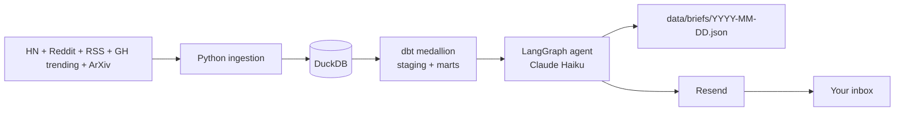

# tech-brief

*A daily TL;DR of tech news, generated by an LLM agent and emailed to you every morning.*

[](https://github.com/SammyBolger/tech-brief/actions/workflows/ci.yml)
[](https://github.com/SammyBolger/tech-brief/actions/workflows/daily.yml)
[](LICENSE)

Every morning at 7am CT, a GitHub Actions cron pulls the last 24 hours of stories from HackerNews, Reddit, half a dozen tech RSS feeds, GitHub trending, and the ArXiv AI category. It runs them through a dbt medallion pipeline in DuckDB, then a LangGraph agent uses Claude Haiku to turn the ranked stories into a categorized digest and Resend delivers it to my inbox. Each day's brief is archived in [`data/briefs/`](data/briefs/) as JSON.

---

## Why I built this

I kept opening HackerNews and my RSS reader in the morning and losing 30 minutes to headlines I did not need to read. I wanted the important ones written down, grouped by topic, with a one-sentence "why you care" per story. Instead of paying for one of the newsletter tools I built one that is tailored to what I actually care about, runs on a free-tier stack, and doubles as a portfolio piece.

## Features

- Ingests HackerNews, Reddit, RSS feeds, GitHub trending, and ArXiv every morning
- dbt medallion pipeline (staging then marts) with a scored ranking of every story
- LangGraph agent groups stories into topics and writes a TL;DR per topic with a "why you care" per story
- Structured output via Claude tool use so the JSON is always valid
- Emails through Resend, archives each day as JSON in `data/briefs/YYYY-MM-DD.json`
- Fully free tier: about 30 cents a month in Claude tokens, everything else zero

## Architecture



**Walkthrough.** GitHub Actions runs on cron at 06:55 CT. Python pulls the last 24 hours of stories from every source into a raw table in DuckDB. dbt builds a staging model per source, unions them into a `fct_stories` mart, scores every row by source weight plus recency plus engagement, and buckets the top rows into topics. The LangGraph agent reads the top rows out of the gold table, groups them by topic, sends them to Claude Haiku with a strict Pydantic schema for the response, and gets back a structured digest. The digest gets written to `data/briefs/YYYY-MM-DD.json` and emailed through Resend.

## Tech Stack

- **Python 3.11 + httpx + feedparser** for ingestion
- **DuckDB** as the local warehouse (single file, no server)
- **dbt-core + dbt-duckdb** for the staging and mart models
- **LangGraph + Anthropic Claude Haiku 4.5** for the summarization agent
- **Resend** for email delivery (100 sends per day on the free tier)
- **GitHub Actions** for the daily cron and CI

## Installation & Setup

See [SETUP.md](SETUP.md) for the full walkthrough (about 15 minutes, all free tier). The short version:

```bash
git clone https://github.com/SammyBolger/tech-brief.git
cd tech-brief

python3 -m venv .venv
source .venv/bin/activate
pip install -e ".[dev]"

cp .env.example .env
# fill in ANTHROPIC_API_KEY, RESEND_API_KEY, DIGEST_FROM_EMAIL, DIGEST_TO_EMAIL

make all
```

## Usage

**Local:**

```bash
make ingest      # pull stories into DuckDB
make transform   # dbt build (staging + marts)
make digest      # run the agent + send the email
make all         # all three in order
```

**In production:** `.github/workflows/daily.yml` runs the whole pipeline on cron at 06:55 CT. Set the same env vars as GitHub Actions secrets and it runs itself every morning.

## API / Output

Each morning the agent writes a structured JSON to `data/briefs/YYYY-MM-DD.json` and commits it back to the repo. Shape:

```json
{
  "date": "2026-08-19",
  "overview": "Two sentences summarizing the day.",
  "topics": [
    {
      "topic": "AI / ML",
      "stories": [
        {
          "title": "...",
          "url": "...",
          "one_liner": "..."
        }
      ]
    }
  ]
}
```

## Engineering Decisions

- **DuckDB over Postgres** because the whole warehouse fits in a single file and the pipeline never needs more than one machine.
- **dbt medallion over a hand-rolled Python transform** because dbt gives me schema tests and lineage for free.
- **LangGraph over a plain function** because named nodes are easier to debug and swap out when the pipeline grows.
- **Claude Haiku 4.5 over Sonnet** because summarization is a cheap task and Haiku is about 15x cheaper.
- **Structured output via tool use, not JSON mode** because the Pydantic schema catches bad output at the boundary.
- **Fresh ingest every run over incremental** because 24 hours of stories is small and the code stays simple.
- **Archive each digest as JSON in the repo** because it makes the portfolio integration a one-shot HTTP fetch, no external DB needed.

## Testing

```bash
pytest -q
```

Covers scoring math, the email template, story deduplication, config loading, and mocked source calls. CI runs `ruff check` and `pytest` on every PR and every push to `main`.

## Limitations & Future Improvements

- No persistent history between runs. Each morning is a fresh pull. Adding MotherDuck later would let me trend topics over weeks.
- Reddit ingestion uses the public JSON API without auth, which rate-limits aggressively. If I ever add more subreddits I need OAuth.
- Topic bucketing is rule-based with keyword matches. Good enough for a personal digest, not good enough for public subscribers.
- No unsubscribe UX yet. Fine while the recipient list is just me.

## License

[MIT](LICENSE)
